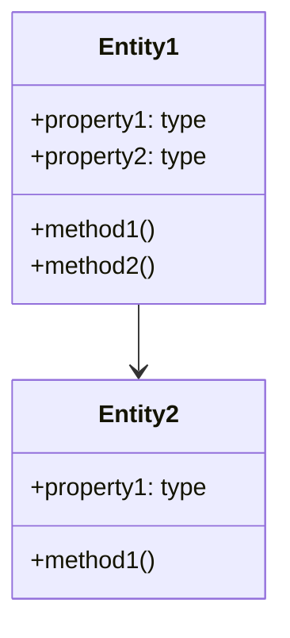

# Documentation Maintenance Guidelines

This document provides guidelines for maintaining the documentation of the AI Fight Club API project. Following these practices ensures that documentation remains accurate, complete, and useful as the codebase evolves.

## Documentation as Code

Documentation should be treated with the same care and rigor as code:

1. **Version Control**: All documentation changes should be committed to the repository
2. **Pull Requests**: Documentation changes should go through the same review process as code
3. **Issue Tracking**: Documentation issues should be tracked alongside code issues
4. **Testing**: Example code in documentation should be verified to work

## Documentation Update Process

### When to Update Documentation

Documentation should be updated in the following situations:

1. When adding new features or APIs
2. When modifying existing features or APIs
3. When fixing bugs that change behavior
4. When refactoring code that affects public interfaces
5. When changing architectural components
6. When identifying errors or gaps in existing documentation

### How to Update Documentation

Follow these steps when updating documentation:

1. **Identify Affected Documentation**: Determine which documentation files need to be updated
2. **Update in Same PR**: Include documentation updates in the same PR as the code changes
3. **Cross-Reference**: Ensure consistency across related documentation
4. **Follow Templates**: Use existing document structures and templates
5. **Update Examples**: Ensure code examples reflect the changes
6. **Update Diagrams**: Update any diagrams affected by the changes
7. **Review Changes**: Have documentation changes reviewed by peers

## Ownership and Responsibility

Each area of documentation has designated owners who are responsible for maintaining its quality and accuracy:

| Documentation Area          | Primary Owner       | Secondary Owner    | Review Cycle |
|----------------------------|---------------------|-------------------|--------------|
| Architecture Documentation  | Lead Architect      | Tech Lead         | Quarterly    |
| API Documentation          | API Team Lead       | Developer         | Monthly      |
| Domain Documentation       | Domain Owner        | Developer         | Monthly      |
| Setup & Deployment         | DevOps Engineer     | Developer         | Quarterly    |
| Workflows                  | Product Manager     | Developer         | Quarterly    |
| External API Integration   | Integration Lead    | Developer         | As APIs change |

## Review Cycles

Regular reviews help maintain documentation quality:

### Monthly Reviews

1. **API Documentation**: Ensure endpoint documentation is up-to-date
2. **Domain Documentation**: Verify domain models and business rules are current

### Quarterly Reviews

1. **Architecture Documentation**: Review for accuracy and completeness
2. **Setup & Deployment**: Verify installation and deployment instructions
3. **Workflow Documentation**: Ensure workflow diagrams reflect current processes
4. **ADRs**: Review for new architectural decisions that should be documented

### Annual Reviews

1. **Complete Documentation Audit**: Comprehensive review of all documentation
2. **Documentation Structure**: Evaluate if the structure needs improvement
3. **Documentation Tools**: Assess if better documentation tooling should be adopted

## Style Guidelines

### Markdown Formatting

1. Use proper heading levels (# for title, ## for sections, etc.)
2. Use code blocks with language identifiers for code examples
3. Use lists for sequential steps or related items
4. Use tables for structured data
5. Use blockquotes for important notes or warnings

### Code Examples

1. Code examples should be minimal but complete
2. Examples should follow project coding standards
3. Use consistent naming conventions across examples
4. Include comments to explain non-obvious parts
5. Test examples to ensure they work

### Diagrams

1. Use Mermaid diagrams when possible for better maintainability
2. Keep diagrams focused on a single concept
3. Include a legend or explanation for complex diagrams
4. Store diagram source files alongside rendered images when possible

## Documentation Structure

Maintain the established documentation structure:

1. **Root Documentation**: Overview, setup, quick start, etc.
2. **Architecture**: System design, patterns, decisions
3. **API Reference**: Endpoints, parameters, responses
4. **Domain Documentation**: Domain models, business rules
5. **Workflows**: End-to-end processes
6. **External APIs**: Integration with third-party services

When adding new documentation, follow this structure and avoid creating documentation in unexpected locations.

## Contribution Guidelines for Non-Owners

Team members who are not designated owners can still contribute to documentation:

1. **Identify Issues**: Report documentation issues using the issue tracker
2. **Suggest Improvements**: Propose enhancements via issues or discussions
3. **Submit PRs**: Create pull requests with documentation changes
4. **Review**: Participate in documentation reviews

All contributions should:
- Follow the style guidelines
- Include a clear description of changes
- Reference related code changes or issues
- Be reviewed by the documentation owner

## Documentation Tools and Resources

### Tools

1. **Markdown Linters**: Use markdownlint to ensure consistent formatting
2. **Mermaid**: Use for diagrams (https://mermaid-js.github.io/)
3. **VSCode Extensions**: Markdown All in One, Mermaid Preview

### Resources

1. **Google Technical Writing Courses**: https://developers.google.com/tech-writing
2. **Microsoft Style Guide**: https://docs.microsoft.com/en-us/style-guide/welcome/
3. **Diátaxis Documentation Framework**: https://diataxis.fr/

## Final Note

Documentation maintenance is everyone's responsibility. By following these guidelines, we ensure that our documentation remains a valuable resource for both new and experienced team members.

## Appendix: Documentation Templates

### API Endpoint Template

```markdown
# Endpoint Name

Brief description of what the endpoint does.

## Request

`METHOD /path/to/endpoint`

### Parameters

| Name | Type | Required | Description |
|------|------|----------|-------------|
| param1 | string | Yes | Description of param1 |
| param2 | number | No | Description of param2 |

### Example Request

```http
METHOD /path/to/endpoint
Content-Type: application/json

{
  "param1": "value1",
  "param2": 123
}
```

## Response

### Success Response

```json
{
  "status": "success",
  "data": {
    "property1": "value1",
    "property2": "value2"
  }
}
```

### Error Response

```json
{
  "status": "error",
  "message": "Error description",
  "errorCode": "ERROR_CODE"
}
```
```

### Domain Model Template

```markdown
# Domain Name

Brief description of the domain and its purpose.

## Key Concepts

Explanation of the main concepts in this domain.

## Domain Model



## Business Rules

1. Rule 1: Description of rule 1
2. Rule 2: Description of rule 2

## Integration Points

Explanation of how this domain interacts with others.
``` 