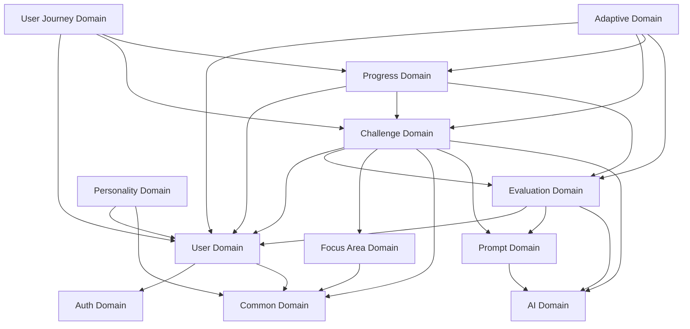

# Domain Relationships

This document illustrates the relationships and dependencies between domains in the system.

## Domain Relationship Diagram



## Key Dependencies

### User Domain
- **Provides to**: Most domains require user information
- **Depends on**: Auth (for authentication), Common (for value objects)

### Challenge Domain
- **Provides to**: Progress, Evaluation, User Journey
- **Depends on**: User, Focus Area, Prompt, AI

### Evaluation Domain
- **Provides to**: Progress, User Journey
- **Depends on**: Challenge, User, Prompt, AI

### Progress Domain
- **Provides to**: User Journey, Adaptive
- **Depends on**: User, Challenge, Evaluation

### Focus Area Domain
- **Provides to**: Challenge, User
- **Depends on**: Common

### Personality Domain
- **Provides to**: User, Prompt
- **Depends on**: User, Common

### Prompt Domain
- **Provides to**: Challenge, Evaluation
- **Depends on**: AI

### Adaptive Domain
- **Provides to**: Challenge, User
- **Depends on**: User, Challenge, Progress, Evaluation

### User Journey Domain
- **Provides to**: User interface
- **Depends on**: User, Challenge, Progress

### AI Domain
- **Provides to**: Prompt, Challenge, Evaluation
- **Depends on**: None (ports & adapters pattern)

### Auth Domain
- **Provides to**: User, system-wide authentication
- **Depends on**: User

### Common Domain
- **Provides to**: All domains (value objects, models)
- **Depends on**: None

## Dependency Management Guidelines

To maintain a clean architecture, consider these guidelines when managing domain dependencies:

1. **Minimize Dependencies**: Each domain should have as few dependencies as possible.

2. **Use Domain Events**: For loose coupling, domains should communicate through domain events when possible.

3. **Dependency Direction**: Higher-level domains (like User Journey) should depend on lower-level domains (like User).

4. **Abstraction**: Use interfaces (in TypeScript) or abstract classes to define dependencies across domain boundaries.

5. **Domain Services**: Use domain services to coordinate operations that span multiple aggregates within a domain.

6. **Application Coordinators**: For operations spanning multiple domains, use application coordinators, not direct domain-to-domain calls.

## Common Dependency Patterns

### Direct Dependencies
Used for synchronous operations where one domain directly needs another:

```javascript
// Evaluation domain service using Challenge domain services
class EvaluationService {
  constructor({ challengeService, userService, /* other dependencies */ }) {
    this.challengeService = challengeService;
    this.userService = userService;
    // ...
  }
  
  async evaluateResponse(challengeId, userId, response) {
    // Get challenge from Challenge domain
    const challenge = await this.challengeService.getChallenge(challengeId);
    
    // Get user from User domain
    const user = await this.userService.getUser(userId);
    
    // Evaluation logic
    // ...
  }
}
```

### Event-Based Dependencies
Used for asynchronous operations where domains communicate through events:

```javascript
// Progress domain subscribing to Challenge domain events
domainEventBus.subscribe('challenge.completed', async (event) => {
  const { challengeId, userId, score } = event.data;
  
  // Progress domain handling the event
  await progressService.updateProgress(userId, challengeId, score);
});
``` 