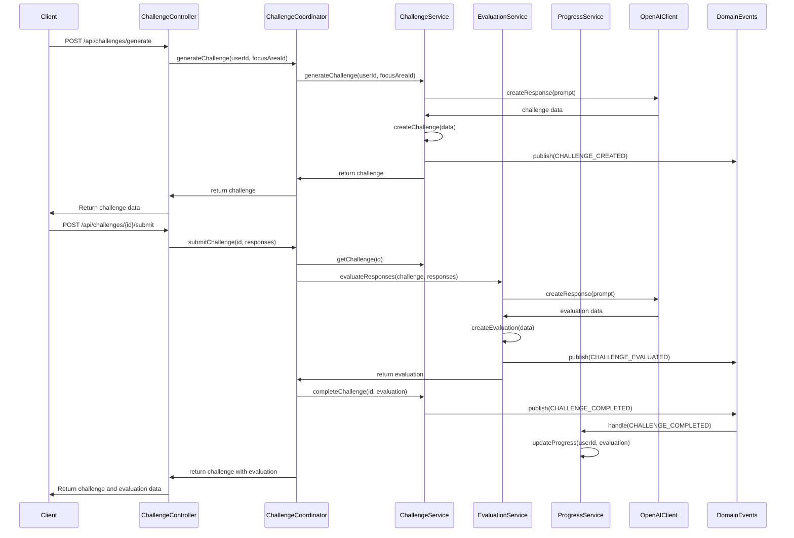

# Challenge Lifecycle Workflow

This document outlines the complete lifecycle of a challenge, from creation through submission to evaluation, explaining how different domains interact throughout the process.

## Workflow Overview

The challenge lifecycle involves several key domains working together:

1. **Challenge Domain**: Manages challenge creation and status
2. **User Domain**: Manages user interactions with challenges
3. **Evaluation Domain**: Evaluates user responses to challenges
4. **Progress Domain**: Tracks and updates user progress

## Sequence Diagram



## Step-by-Step Process

### 1. Challenge Generation

The process begins when a user requests a new challenge:

```http
POST /api/challenges/generate
Content-Type: application/json

{
  "userId": "user123",
  "focusAreaId": "focus456",
  "difficulty": "intermediate"
}
```

#### Challenge Controller

The `ChallengeController` receives the HTTP request and delegates to the `ChallengeCoordinator`:

```javascript
// src/core/challenge/controllers/ChallengeController.js
async generateChallenge(req, res) {
  try {
    const { userId, focusAreaId, difficulty } = req.body;
    const challenge = await this.challengeCoordinator.generateChallenge(
      userId, 
      focusAreaId, 
      difficulty
    );
    return res.status(201).json(challenge);
  } catch (error) {
    return res.status(400).json({ error: error.message });
  }
}
```

#### Challenge Coordinator

The `ChallengeCoordinator` orchestrates the challenge generation process:

```javascript
// src/application/coordinators/ChallengeCoordinator.js
async generateChallenge(userId, focusAreaId, difficulty = 'medium') {
  // Verify user and focus area exist
  const user = await this.userService.getUserById(userId);
  const focusArea = await this.focusAreaService.getFocusAreaById(focusAreaId);
  
  // Generate the challenge
  const challenge = await this.challengeService.generateChallenge(
    userId, 
    focusAreaId, 
    { difficulty }
  );
  
  return challenge;
}
```

#### Challenge Service

The `ChallengeService` creates the challenge using OpenAI and the prompt system:

```javascript
// src/core/challenge/services/ChallengeService.js
async generateChallenge(userId, focusAreaId, options = {}) {
  // Get related data
  const user = await this.userRepository.getById(userId);
  const focusArea = await this.focusAreaRepository.getById(focusAreaId);
  const personality = await this.personalityRepository.getByUserId(userId);
  
  // Build the prompt
  const prompt = await this.promptBuilder.buildPrompt('challenge', {
    user,
    focusArea,
    personality,
    options
  });
  
  // Generate the challenge using OpenAI
  const response = await this.openaiClient.createResponse({
    input: prompt,
    instructions: "Generate a personalized challenge for this user based on their focus area and personality...",
    response_format: { type: "json_object" }
  });
  
  // Create the challenge entity
  const challenge = new Challenge({
    userId,
    focusAreaId,
    title: response.output.title,
    description: response.output.description,
    difficulty: response.output.difficulty || options.difficulty,
    questions: response.output.questions,
    status: 'active'
  });
  
  // Save the challenge
  await this.challengeRepository.save(challenge);
  
  // Publish domain event
  await domainEvents.publish('CHALLENGE_CREATED', {
    challengeId: challenge.id,
    userId,
    focusAreaId,
    difficulty: challenge.difficulty
  });
  
  return challenge;
}
```

### 2. Challenge Submission

When a user submits responses to a challenge:

```http
POST /api/challenges/c123/submit
Content-Type: application/json

{
  "responses": [
    {
      "questionId": "q1",
      "answer": "Bias can come from imbalanced training data where certain demographics are underrepresented..."
    },
    {
      "questionId": "q2",
      "answer": "A methodical approach would include: 1) Analyzing performance across different demographic groups..."
    }
  ]
}
```

#### Challenge Controller

```javascript
// src/core/challenge/controllers/ChallengeController.js
async submitChallenge(req, res) {
  try {
    const { challengeId } = req.params;
    const { responses } = req.body;
    
    const result = await this.challengeCoordinator.submitChallenge(
      challengeId, 
      responses
    );
    
    return res.status(200).json(result);
  } catch (error) {
    return res.status(400).json({ error: error.message });
  }
}
```

#### Challenge Coordinator

```javascript
// src/application/coordinators/ChallengeCoordinator.js
async submitChallenge(challengeId, responses) {
  // Get the challenge
  const challenge = await this.challengeService.getChallengeById(challengeId);
  
  if (challenge.status !== 'active') {
    throw new Error('Challenge is not active');
  }
  
  // Evaluate the responses
  const evaluation = await this.evaluationService.evaluateResponses(
    challenge, 
    responses
  );
  
  // Complete the challenge
  const completedChallenge = await this.challengeService.completeChallenge(
    challengeId, 
    evaluation
  );
  
  return {
    challenge: completedChallenge,
    evaluation
  };
}
```

### 3. Response Evaluation

The `EvaluationService` evaluates user responses:

```javascript
// src/core/evaluation/services/EvaluationService.js
async evaluateResponses(challenge, responses) {
  // Organize responses by question ID for easier processing
  const responseMap = {};
  responses.forEach(response => {
    responseMap[response.questionId] = response.answer;
  });
  
  // Ensure all questions have responses
  const missingResponses = challenge.questions
    .filter(q => !responseMap[q.id])
    .map(q => q.id);
    
  if (missingResponses.length > 0) {
    throw new Error(`Missing responses for questions: ${missingResponses.join(', ')}`);
  }
  
  // Build the evaluation prompt
  const prompt = await this.promptBuilder.buildPrompt('evaluation', {
    challenge,
    responses: responseMap,
    userId: challenge.userId
  });
  
  // Get evaluation from OpenAI
  const result = await this.openaiClient.createResponse({
    input: prompt,
    instructions: "Evaluate these responses based on accuracy, depth, creativity, and critical thinking...",
    response_format: { type: "json_object" },
    conversation_id: challenge.conversationId // If we're maintaining conversation state
  });
  
  // Create and save the evaluation
  const evaluation = new Evaluation({
    challengeId: challenge.id,
    userId: challenge.userId,
    responses,
    overallScore: result.output.overallScore,
    feedback: result.output.feedback,
    strengths: result.output.strengths,
    weaknesses: result.output.weaknesses,
    questionScores: result.output.questionScores,
    createdAt: new Date().toISOString()
  });
  
  await this.evaluationRepository.save(evaluation);
  
  // Publish domain event
  await domainEvents.publish('CHALLENGE_EVALUATED', {
    challengeId: challenge.id,
    userId: challenge.userId,
    evaluationId: evaluation.id,
    score: evaluation.overallScore
  });
  
  return evaluation;
}
```

### 4. Challenge Completion

The `ChallengeService` marks the challenge as completed:

```javascript
// src/core/challenge/services/ChallengeService.js
async completeChallenge(challengeId, evaluation) {
  const challenge = await this.challengeRepository.getById(challengeId);
  
  if (challenge.status === 'completed') {
    throw new Error('Challenge is already completed');
  }
  
  // Update challenge status
  challenge.status = 'completed';
  challenge.completedAt = new Date().toISOString();
  challenge.score = evaluation.overallScore;
  challenge.evaluationId = evaluation.id;
  
  // Save updated challenge
  await this.challengeRepository.save(challenge);
  
  // Publish domain event
  await domainEvents.publish('CHALLENGE_COMPLETED', {
    challengeId: challenge.id,
    userId: challenge.userId,
    focusAreaId: challenge.focusAreaId,
    score: evaluation.overallScore,
    strengths: evaluation.strengths,
    weaknesses: evaluation.weaknesses
  });
  
  return challenge;
}
```

### 5. Progress Update

The `ProgressService` listens for the `CHALLENGE_COMPLETED` event to update user progress:

```javascript
// Register event handler during application startup
domainEvents.registerHandler('CHALLENGE_COMPLETED', async (event) => {
  const { userId, challengeId, score, strengths, weaknesses } = event.data;
  await progressService.updateProgress(userId, {
    challengeId,
    score,
    strengths,
    weaknesses
  });
});

// src/core/progress/services/ProgressService.js
async updateProgress(userId, challengeData) {
  // Get user progress or create new
  let progress = await this.progressRepository.getByUserId(userId);
  
  if (!progress) {
    progress = new Progress({
      userId,
      completedChallenges: 0,
      averageScore: 0,
      strengths: {},
      weaknesses: {},
      streaks: {
        current: 0,
        longest: 0
      }
    });
  }
  
  // Update progress stats
  progress.completedChallenges += 1;
  
  // Update average score
  const totalScore = progress.averageScore * (progress.completedChallenges - 1) + challengeData.score;
  progress.averageScore = totalScore / progress.completedChallenges;
  
  // Update strengths and weaknesses
  challengeData.strengths.forEach(strength => {
    progress.strengths[strength] = (progress.strengths[strength] || 0) + 1;
  });
  
  challengeData.weaknesses.forEach(weakness => {
    progress.weaknesses[weakness] = (progress.weaknesses[weakness] || 0) + 1;
  });
  
  // Update streaks
  const lastActive = new Date(progress.lastActive || 0);
  const now = new Date();
  const daysSinceLastChallenge = Math.floor((now - lastActive) / (1000 * 60 * 60 * 24));
  
  if (daysSinceLastChallenge <= 1) {
    progress.streaks.current += 1;
    progress.streaks.longest = Math.max(progress.streaks.current, progress.streaks.longest);
  } else if (daysSinceLastChallenge > 1) {
    progress.streaks.current = 1;
  }
  
  progress.lastActive = now.toISOString();
  
  // Save updated progress
  await this.progressRepository.save(progress);
  
  // If significant milestone reached, publish event
  if (progress.completedChallenges % 5 === 0 || progress.streaks.current % 5 === 0) {
    await domainEvents.publish('PROGRESS_MILESTONE_REACHED', {
      userId,
      completedChallenges: progress.completedChallenges,
      currentStreak: progress.streaks.current,
      longestStreak: progress.streaks.longest
    });
  }
  
  return progress;
}
```

### 6. Response to Client

The final response includes both the completed challenge and its evaluation:

```json
{
  "challenge": {
    "id": "c123",
    "title": "AI Bias Mitigation Challenge",
    "description": "Design an approach to identify and mitigate bias in a machine learning model",
    "difficulty": "intermediate",
    "questions": [
      {
        "id": "q1",
        "text": "What are potential sources of bias in this dataset?"
      },
      {
        "id": "q2",
        "text": "Propose a methodical approach to identify bias in the model outputs."
      }
    ],
    "status": "completed",
    "score": 85,
    "evaluationId": "e456",
    "completedAt": "2023-09-15T15:30:00Z"
  },
  "evaluation": {
    "id": "e456",
    "challengeId": "c123",
    "userId": "user123",
    "overallScore": 85,
    "feedback": "Your responses demonstrate a good understanding of AI bias concerns...",
    "strengths": [
      "technical-understanding", 
      "ethical-considerations"
    ],
    "weaknesses": [
      "implementation-details"
    ],
    "questionScores": {
      "q1": 90,
      "q2": 80
    },
    "createdAt": "2023-09-15T15:29:00Z"
  }
}
```

## Error Handling

The workflow handles various error cases, including:

1. **Invalid Challenge ID**: Attempt to submit to a non-existent challenge
2. **Missing Responses**: Not all questions are answered
3. **Already Completed**: Attempt to submit to an already completed challenge
4. **OpenAI API Failures**: Issues with the evaluation process
5. **Repository Errors**: Problems with data persistence

## Key Domain Events

This workflow uses the following domain events:

1. `CHALLENGE_CREATED`: Published when a new challenge is created
2. `CHALLENGE_EVALUATED`: Published when responses are evaluated
3. `CHALLENGE_COMPLETED`: Published when a challenge is marked complete
4. `PROGRESS_MILESTONE_REACHED`: Published when a user reaches significant progress milestones

## Storing Conversation State

For challenges that involve multiple interactions or follow-ups, we maintain conversation state using the Responses API's built-in conversation management:

```javascript
// When generating a challenge
const response = await this.openaiClient.createResponse({
  // ... other parameters
});

// Store the conversation ID with the challenge
challenge.conversationId = response.conversation_id;

// When evaluating, use the same conversation ID
const evaluation = await this.openaiClient.createResponse({
  // ... other parameters
  conversation_id: challenge.conversationId
});
```

## Testing

The workflow can be tested at different levels:

```javascript
// tests/e2e/challenge-lifecycle.test.js
describe('Challenge Lifecycle', () => {
  let userId, focusAreaId, challengeId;
  
  before(async () => {
    // Create test user and focus area
    userId = 'test-user-123';
    focusAreaId = 'test-focus-456';
  });
  
  it('should generate a new challenge', async () => {
    const response = await request(app)
      .post('/api/challenges/generate')
      .send({
        userId,
        focusAreaId
      });
    
    expect(response.status).toBe(201);
    expect(response.body.id).toBeDefined();
    expect(response.body.questions.length).toBeGreaterThan(0);
    
    challengeId = response.body.id;
  });
  
  it('should submit responses and get evaluation', async () => {
    const response = await request(app)
      .post(`/api/challenges/${challengeId}/submit`)
      .send({
        responses: [
          {
            questionId: 'q1',
            answer: 'Test response to question 1'
          },
          {
            questionId: 'q2',
            answer: 'Test response to question 2'
          }
        ]
      });
    
    expect(response.status).toBe(200);
    expect(response.body.challenge.status).toBe('completed');
    expect(response.body.evaluation).toBeDefined();
    expect(response.body.evaluation.overallScore).toBeDefined();
  });
}); 