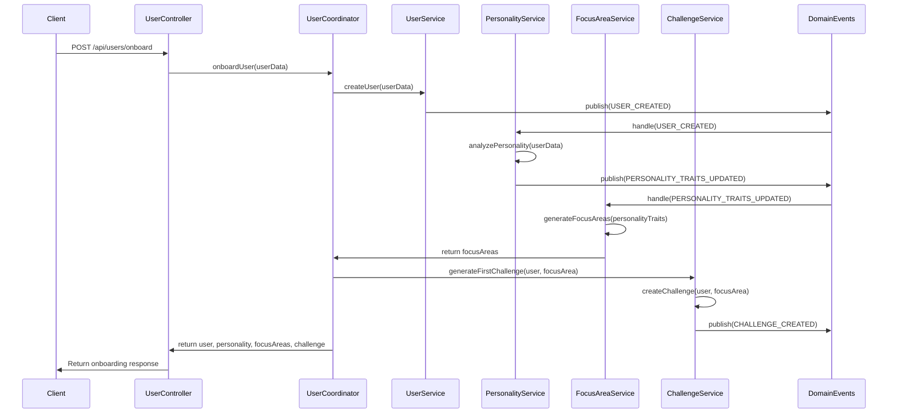

# User Onboarding and First Challenge Workflow

This document outlines the end-to-end workflow for onboarding a new user and generating their first personalized challenge, explaining how different domains interact throughout the process.

## Workflow Overview

The user onboarding and first challenge workflow involves several domains working together:

1. **User Domain**: Creates and manages user profiles
2. **Personality Domain**: Analyzes user traits and generates insights
3. **Focus Area Domain**: Determines recommended focus areas
4. **Challenge Domain**: Generates personalized challenges

## Sequence Diagram



## Step-by-Step Process

### 1. User Submits Onboarding Data

The process begins when a user submits their information through the onboarding form:

```http
POST /api/users/onboard
Content-Type: application/json

{
  "fullName": "John Doe",
  "email": "john@example.com",
  "professionalTitle": "Software Engineer",
  "location": "San Francisco",
  "country": "USA",
  "personalityTraits": {
    "creativity": 85,
    "analyticalThinking": 90,
    "empathy": 70,
    "riskTaking": 65,
    "adaptability": 80
  },
  "aiAttitudes": {
    "trust": 60,
    "jobConcerns": 40,
    "impact": 75,
    "interest": 90,
    "interaction": 85
  }
}
```

### 2. User Controller Processes Request

The `UserController` receives the HTTP request and delegates to the `UserCoordinator`:

```javascript
// src/core/user/controllers/UserController.js
async onboardUser(req, res) {
  try {
    const userData = req.body;
    const result = await this.userCoordinator.onboardUser(userData);
    return res.status(201).json(result);
  } catch (error) {
    return res.status(400).json({ error: error.message });
  }
}
```

### 3. User Coordinator Orchestrates the Process

The `UserCoordinator` orchestrates the entire onboarding process, interacting with multiple services:

```javascript
// src/application/coordinators/UserCoordinator.js
async onboardUser(userData) {
  // Create the user
  const user = await this.userService.createUser(userData);
  
  // Wait for personality analysis (triggered via domain event)
  const personality = await this.personalityService.getPersonalityByUserId(user.id);
  
  // Generate focus areas based on personality
  const focusAreas = await this.focusAreaService.generateFocusAreas(user.id, personality);
  
  // Select the primary focus area
  const primaryFocusArea = focusAreas[0];
  
  // Generate first challenge
  const challenge = await this.challengeService.generateChallenge(
    user.id, 
    primaryFocusArea.id
  );
  
  return {
    user,
    personality,
    focusAreas,
    challenge
  };
}
```

### 4. User Creation and Domain Event

The `UserService` creates the user and publishes a domain event:

```javascript
// src/core/user/services/UserService.js
async createUser(userData) {
  const user = new User(userData);
  await this.userRepository.save(user);
  
  // Publish domain event
  await domainEvents.publish('USER_CREATED', { 
    userId: user.id,
    email: user.email,
    // Other relevant user data
  });
  
  return user;
}
```

### 5. Personality Analysis

The `PersonalityService` listens for the `USER_CREATED` event and performs analysis:

```javascript
// Event handler registered during application startup
domainEvents.registerHandler('USER_CREATED', async (event) => {
  const { userId, ...userData } = event.data;
  await personalityService.analyzePersonality(userId, userData);
});

// src/core/personality/services/PersonalityService.js
async analyzePersonality(userId, userData) {
  // Use OpenAI to analyze personality traits
  const prompt = await this.promptBuilder.buildPrompt('personality', {
    userData
  });
  
  const analysis = await this.openaiClient.createResponse({
    input: prompt,
    instructions: "Analyze this user's personality based on their traits...",
    response_format: { type: "json_object" }
  });
  
  const personalityProfile = new PersonalityProfile({
    userId,
    traits: userData.personalityTraits,
    aiAttitudes: userData.aiAttitudes,
    analysis: analysis.output
  });
  
  await this.personalityRepository.save(personalityProfile);
  
  // Publish the personality traits updated event
  await domainEvents.publish('PERSONALITY_TRAITS_UPDATED', {
    userId,
    personalityTraits: personalityProfile.traits,
    dominantTraits: personalityProfile.getDominantTraits()
  });
  
  return personalityProfile;
}
```

### 6. Focus Area Generation

The `FocusAreaService` generates recommended focus areas based on personality:

```javascript
// src/core/focusArea/services/FocusAreaService.js
async generateFocusAreas(userId, personality) {
  const prompt = await this.promptBuilder.buildPrompt('focusArea', {
    personality
  });
  
  const response = await this.openaiClient.createResponse({
    input: prompt,
    instructions: "Generate focus areas that would benefit this user based on their personality profile...",
    response_format: { type: "json_object" }
  });
  
  const focusAreas = response.output.focusAreas.map(
    focusAreaData => new FocusArea({
      userId,
      name: focusAreaData.name,
      description: focusAreaData.description,
      traits: focusAreaData.traits,
      priority: focusAreaData.priority
    })
  );
  
  // Save all focus areas
  await Promise.all(
    focusAreas.map(focusArea => this.focusAreaRepository.save(focusArea))
  );
  
  return focusAreas;
}
```

### 7. Challenge Generation

Finally, the `ChallengeService` generates the first challenge:

```javascript
// src/core/challenge/services/ChallengeService.js
async generateChallenge(userId, focusAreaId) {
  // Get the user and focus area
  const user = await this.userRepository.getById(userId);
  const focusArea = await this.focusAreaRepository.getById(focusAreaId);
  const personality = await this.personalityRepository.getByUserId(userId);
  
  // Build the prompt for challenge generation
  const prompt = await this.promptBuilder.buildPrompt('challenge', {
    user,
    focusArea,
    personality
  });
  
  // Generate the challenge using OpenAI
  const response = await this.openaiClient.createResponse({
    input: prompt,
    instructions: "Generate a personalized challenge for this user based on their focus area and personality...",
    response_format: { type: "json_object" }
  });
  
  // Create the challenge entity
  const challenge = new Challenge({
    userId,
    focusAreaId,
    title: response.output.title,
    description: response.output.description,
    difficulty: response.output.difficulty,
    questions: response.output.questions,
    status: 'active'
  });
  
  // Save the challenge
  await this.challengeRepository.save(challenge);
  
  // Publish the challenge created event
  await domainEvents.publish('CHALLENGE_CREATED', {
    challengeId: challenge.id,
    userId,
    focusAreaId,
    difficulty: challenge.difficulty
  });
  
  return challenge;
}
```

### 8. Response to Client

The complete onboarding data is returned to the client:

```json
{
  "user": {
    "id": "u123",
    "email": "john@example.com",
    "fullName": "John Doe",
    "professionalTitle": "Software Engineer",
    "createdAt": "2023-09-10T14:30:00Z"
  },
  "personality": {
    "traits": {
      "creativity": 85,
      "analyticalThinking": 90,
      "empathy": 70,
      "riskTaking": 65,
      "adaptability": 80
    },
    "dominantTraits": ["analyticalThinking", "creativity", "adaptability"],
    "insights": "You demonstrate strong analytical skills with creative tendencies..."
  },
  "focusAreas": [
    {
      "id": "fa123",
      "name": "AI Ethics",
      "description": "Exploring ethical considerations in AI development",
      "priority": "high"
    },
    {
      "id": "fa124",
      "name": "Creative Problem Solving",
      "description": "Applying creativity to technical challenges",
      "priority": "medium"
    }
  ],
  "challenge": {
    "id": "c123",
    "title": "AI Bias Mitigation Challenge",
    "description": "Design an approach to identify and mitigate bias in a machine learning model",
    "difficulty": "intermediate",
    "questions": [
      {
        "id": "q1",
        "text": "What are potential sources of bias in this dataset?"
      },
      {
        "id": "q2",
        "text": "Propose a methodical approach to identify bias in the model outputs."
      }
    ],
    "status": "active"
  }
}
```

## Error Handling

The workflow handles various error cases, including:

1. **Invalid User Data**: Validation errors in the user input
2. **Email Already Exists**: Attempt to register with an existing email
3. **OpenAI API Failures**: Issues with personality analysis or challenge generation
4. **Database Errors**: Problems saving to repositories

All services implement proper error handling that propagates meaningful error messages to the coordinator, which can then provide appropriate responses to the client.

## Key Domain Events

This workflow uses the following domain events:

1. `USER_CREATED`: Published when a new user is created
2. `PERSONALITY_TRAITS_UPDATED`: Published when personality analysis is complete
3. `CHALLENGE_CREATED`: Published when a new challenge is created

## Testing

The workflow can be tested at different levels:

1. **Unit Tests**: Test individual services in isolation
2. **Integration Tests**: Test interactions between specific services
3. **End-to-End Tests**: Test the entire workflow from HTTP request to response

Example end-to-end test:

```javascript
// tests/e2e/user-onboarding.test.js
describe('User Onboarding Workflow', () => {
  it('should successfully onboard a user and generate first challenge', async () => {
    const response = await request(app)
      .post('/api/users/onboard')
      .send({
        fullName: 'Test User',
        email: `test-${Date.now()}@example.com`,
        // ... other user data
      });
    
    expect(response.status).toBe(201);
    expect(response.body.user).toBeDefined();
    expect(response.body.personality).toBeDefined();
    expect(response.body.focusAreas.length).toBeGreaterThan(0);
    expect(response.body.challenge).toBeDefined();
  });
}); 